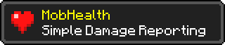

<p align="center"></p>

# MobHealth (NeoForge)

A modern **NeoForge** rewrite of the classic [MobHealth](https://github.com/Sablednah/Mobhealth)
Bukkit plugin. When you damage a mob, MobHealth shows how much damage you dealt and how much health
the mob has left — through any combination of display modes, from vanilla-friendly text to real
graphical floating bars.

| | |
|---|---|
| **Minecraft** | 1.21.11 |
| **Loader** | NeoForge 21.11.42 |
| **Java** | 21 |
| **License** | MIT |

---

## Contents

- [Display modes](#display-modes)
- [Installation](#installation)
- [Commands](#commands)
- [Permissions](#permissions)
- [Configuration](#configuration)
  - [Server / common config](#server--common-config-mobhealth-commontoml)
  - [Client config](#client-config-mobhealth-clienttoml)
  - [Server-enforced graphical options](#server-enforced-graphical-options-graphicalenforce)
- [Recipes](#recipes-common-setups)
- [How MobHealth decides what to show](#how-mobhealth-decides-what-to-show)
- [Building from source](#building-from-source)
- [License](#license)

---

## Display modes

All four modes can be enabled independently and combined freely. The first three are **server-side**
and work on **unmodified vanilla clients** — players don't need to install anything. The graphical
bars are **client-rendered** and require the mod on the client.

| Mode | What it looks like | Needs the mod on the client? |
|------|--------------------|------------------------------|
| **Chat** | `Zombie [\|\|\|\|\|\|\|\|\|\|] 14/20 (-6)` sent to you when you hit a mob | No |
| **Action bar** | The same readout on the text line just above your hotbar | No |
| **Nameplate** | A coloured health bar on the mob's name tag above its head | No |
| **Boss bar** | The vanilla boss-bar widget at the top of your screen | No |
| **Toast** | An achievement-style popup (top-right) with a heart, the mob's name and health | **Yes** |
| **Graphical** | A crisp pixel health bar floating above the mob in the world | **Yes** |

Bars are coloured by remaining health: **green → yellow → red**.

> **Note on the nameplate:** a name tag is a single shared property on the mob, so *everyone* nearby
> sees the same one. The per-player `audience`, the personal mute (`/mobhealth toggle`), and the
> `mobhealth.see` permission therefore apply to **chat, boss bar, and graphical** bars — they cannot
> hide a nameplate from an individual player.

---

## Installation

Download / build `mobhealth-<version>.jar` and drop it into the `mods/` folder.

- **Singleplayer:** install on your game. All modes work.
- **Dedicated server:** install on the server. Chat, nameplate, and boss bar work for **every**
  player, vanilla or modded. Players who *also* install the mod additionally get the graphical bars.
- **Client only (e.g. on a vanilla server):** you'll see graphical bars for any mob you can see; the
  server can't send you chat/boss-bar/nameplate data because it doesn't have the mod.

MobHealth works as a **server-only**, **client-only**, or **both-sides** install.

---

## Commands

| Command | Who can use it | Description |
|---------|----------------|-------------|
| `/mobhealth reload` | Ops (permission level 2+) | Re-pushes settings (including graphical enforcement) to online players. Config edits also auto-apply when the file is saved, so this is rarely needed. |
| `/mobhealth toggle` | Everyone | Toggles **your own** displays on/off. Your choice is saved and persists across logouts and deaths. |
| `/mobhealth toggle on` | Everyone | Turns your displays on. |
| `/mobhealth toggle off` | Everyone | Turns your displays off (hides chat, boss bar, and graphical bars for you). |

---

## Permissions

MobHealth uses NeoForge's permission system. Everything works out of the box using vanilla
**operator levels**, and if you install a permissions manager such as
**[LuckPerms](https://luckperms.net/)** (which has a NeoForge build) you can manage the nodes
per-group with no extra setup.

| Node / gate | Default | Controls |
|-------------|---------|----------|
| `mobhealth.see` | everyone | Whether a player **receives** displays at all (chat, boss bar, graphical). Deny it to hide MobHealth from a rank. |
| `/mobhealth reload` | op level 2 | Access to the reload command. |
| `/mobhealth toggle` | everyone | Access to the personal toggle. |

Example with LuckPerms — hide MobHealth from the `guest` group:

```
/lp group guest permission set mobhealth.see false
```

---

## Configuration

MobHealth has **two** config files, generated on first run in your instance's `config/` folder:

| File | Side | Purpose |
|------|------|---------|
| `mobhealth-common.toml` | server / singleplayer | What is shown, to whom, and how (all the server-side logic). |
| `mobhealth-client.toml` | client | The appearance of **your** graphical bars. |

Both can also be edited **in-game** via **Esc → Mods → MobHealth → Config**. Changes to the common
file apply as soon as you save; `/mobhealth reload` re-pushes settings to connected clients.

### Server / common config (`mobhealth-common.toml`)

#### `[display]` — the master on/off switch for each mode

| Key | Default | Values | Description |
|-----|---------|--------|-------------|
| `chat` | `true` | bool | Send a chat message to the viewer with damage dealt and health left. |
| `actionBar` | `true` | bool | Show the readout on the action bar (text above the hotbar). |
| `toast` | `false` | bool | Pop an achievement-style toast (top-right). Requires the mod on the client. |
| `nameplate` | `false` | bool | Put a health bar on the mob's name tag. |
| `bossBar` | `false` | bool | Show the top-of-screen boss-bar widget. |
| `graphical` | `true` | bool | Allow modded clients to draw graphical floating bars. |

Each mode's own options are in its matching section below.

#### `[audience]` — who receives the per-viewer displays

Applies to chat, action bar, boss bar, toast, and graphical. (The nameplate is a shared name tag, always visible to everyone nearby.)

| Key | Default | Values | Description |
|-----|---------|--------|-------------|
| `audience` | `ATTACKER` | `ATTACKER`, `NEARBY` | `ATTACKER` = only the player who hit the mob; `NEARBY` = everyone within `nearbyRadius`. |
| `nearbyRadius` | `32` | `4`–`128` | Radius (blocks) for `audience = NEARBY`. |

#### `[targets]` — which mobs trigger a display

| Key | Default | Values | Description |
|-----|---------|--------|-------------|
| `hostile` | `true` | bool | Hostile monsters (zombies, skeletons, creepers, …). |
| `neutral` | `true` | bool | Neutral mobs — passive until provoked (endermen, wolves, bees, …). |
| `passive` | `true` | bool | Passive animals (cows, sheep, chickens, …). |
| `players` | `false` | bool | Other players (PvP). |
| `bosses` | `true` | bool | Boss entities (Ender Dragon, Wither). |
| `hideUntilDamaged` | `true` | bool | Only show once a mob is below full health. |
| `overrides` | `["minecraft:armor_stand=false"]` | list | Force specific entities on/off, **beating their group**. Format `"namespace:id=true\|false"`. |

Example `overrides`:

```toml
overrides = ["minecraft:villager=false", "minecraft:ender_dragon=true", "somemod:custom_boss=true"]
```

#### `[chat]`

| Key | Default | Values | Description |
|-----|---------|--------|-------------|
| `chatContent` | `BOTH` | `BAR`, `NUMBERS`, `BOTH` | What the chat message includes. |

#### `[actionbar]`

| Key | Default | Values | Description |
|-----|---------|--------|-------------|
| `actionBarContent` | `BOTH` | `BAR`, `NUMBERS`, `BOTH` | What the action bar shows. |

#### `[nameplate]`

| Key | Default | Values | Description |
|-----|---------|--------|-------------|
| `mode` | `ON_DAMAGE` | `ON_DAMAGE`, `NAMED_ONLY`, `ALWAYS` | `ON_DAMAGE`: show a bar briefly after each hit, then revert. `NAMED_ONLY`: only decorate mobs that already have a name tag. `ALWAYS`: show after a hit and keep it. |
| `content` | `BOTH` | `BAR`, `NUMBERS`, `BOTH` | What the nameplate shows. |

#### `[bossbar]`

| Key | Default | Values | Description |
|-----|---------|--------|-------------|
| `color` | `RED` | `PINK`, `BLUE`, `RED`, `GREEN`, `YELLOW`, `PURPLE`, `WHITE` | Boss-bar colour. |

#### `[toast]`

| Key | Default | Values | Description |
|-----|---------|--------|-------------|
| `projectileIcon` | `PROJECTILE` | `PROJECTILE`, `WEAPON` | For ranged hits, show the projectile (arrow/trident) or the firing weapon (bow/crossbow). Falls back gracefully for modded projectiles. |

#### `[bar]` — text bar appearance (chat, action bar, nameplate)

| Key | Default | Values | Description |
|-----|---------|--------|-------------|
| `segments` | `20` | `1`–`100` | Number of segments in the bar. |
| `filledChar` | `"\|"` | string | Glyph for a filled segment. |
| `emptyChar` | `"\|"` | string | Glyph for a depleted segment. Keep it the **same** as `filledChar` for a constant-width bar (depleted segments are simply dimmed). A different glyph like `" "` gives the classic `[\|\|\|   ]` look but the bar changes width as health changes, because Minecraft's font is proportional. |
| `valueStyle` | `CURRENT_MAX` | `NONE`, `CURRENT_MAX`, `PERCENT` | Numeric readout: none, `14/20`, or `70%`. |

#### `[timing]` — how long bars linger (in ticks; 20 ticks = 1 second)

| Key | Default | Range | Description |
|-----|---------|-------|-------------|
| `displayTicks` | `100` | `20`–`1200` | Default lifetime after the last hit (100 = 5s). |
| `displayTicksHostile` | `-1` | `-1`–`1200` | Per-group override; `-1` = use default. |
| `displayTicksNeutral` | `-1` | `-1`–`1200` | Per-group override. |
| `displayTicksPassive` | `-1` | `-1`–`1200` | Per-group override. |
| `deathTicks` | `20` | `0`–`600` | How long a bar lingers **after the mob dies** (kept short so an empty bar doesn't hang around). |

#### `[graphicalEnforce]`

See [Server-enforced graphical options](#server-enforced-graphical-options-graphicalenforce) below.

### Client config (`mobhealth-client.toml`)

These control the appearance of **your own** graphical bars. A server can override any of them (see
below); when it doesn't, these values apply.

`[graphical]`

| Key | Default | Values | Description |
|-----|---------|--------|-------------|
| `enabled` | `true` | bool | Master switch for graphical bars on your client. |
| `verticalOffset` | `0.5` | `-2.0`–`6.0` | Extra height (blocks) above the mob's head. |
| `maxDistance` | `24.0` | `4.0`–`96.0` | Only draw bars for mobs within this many blocks. |
| `barWidth` | `40` | `8`–`200` | Bar width in pixels (at scale 1.0). |
| `barHeight` | `4` | `1`–`24` | Bar height in pixels (at scale 1.0). |
| `barStyle` | `SOLID` | `SOLID`, `ROUNDED`, `SEGMENTED`, `TAPERED` | Bar shape. `SEGMENTED` = notched chunks; `TAPERED` = lens/leaf. |
| `segments` | `10` | `2`–`50` | Number of chunks for the `SEGMENTED` style. |
| `scale` | `1.0` | `0.25`–`4.0` | Overall size multiplier for the bar and its outline. |
| `scaleWithDistance` | `false` | bool | Shrink bars as the mob gets further away, so they feel anchored in the world. |
| `fadeWithDistance` | `false` | bool | Fade bars out as the mob approaches `maxDistance`. |
| `showBackground` | `true` | bool | Draw a dark outline behind the bar. |
| `showText` | `true` | bool | Draw the numeric health above the bar. |
| `showPlayers` | `false` | bool | Also draw bars above other players. |
| `onlyWhenDamaged` | `true` | bool | Only draw a bar once the mob is hurt. |
| `requireLineOfSight` | `true` | bool | Only draw bars for mobs you can actually see (not through terrain). |

### Server-enforced graphical options (`[graphicalEnforce]`)

Graphical bars are drawn by the client, but a server can **enforce** any of the client's graphical
settings — useful for fairness (e.g. force line-of-sight so nobody sees mobs through walls) or a
consistent look. Each client option is resolved as: **server override if set, otherwise the
client's own config**. On a vanilla / non-MobHealth server, nothing is enforced and the client keeps
full control.

**Boolean options** use a three-way value:

- `CLIENT` — let each client decide (their config wins). *(default)*
- `ON` — force the option **on** for everyone.
- `OFF` — force the option **off** for everyone.

**Numeric options** use an `enforce<X>` toggle plus the value to force.

| Key | Default | Values | Enforces (client option) |
|-----|---------|--------|--------------------------|
| `lineOfSight` | `CLIENT` | `CLIENT`/`ON`/`OFF` | `requireLineOfSight` |
| `numbers` | `CLIENT` | `CLIENT`/`ON`/`OFF` | `showText` |
| `background` | `CLIENT` | `CLIENT`/`ON`/`OFF` | `showBackground` |
| `showPlayers` | `CLIENT` | `CLIENT`/`ON`/`OFF` | `showPlayers` |
| `onlyWhenDamaged` | `CLIENT` | `CLIENT`/`ON`/`OFF` | `onlyWhenDamaged` |
| `enforceVerticalOffset` / `verticalOffsetValue` | `false` / `0.5` | bool / `-2.0`–`6.0` | `verticalOffset` |
| `enforceMaxDistance` / `maxDistanceValue` | `false` / `24.0` | bool / `4.0`–`96.0` | `maxDistance` |
| `enforceBarWidth` / `barWidthValue` | `false` / `40` | bool / `8`–`200` | `barWidth` |
| `enforceBarHeight` / `barHeightValue` | `false` / `4` | bool / `1`–`24` | `barHeight` |
| `enforceScale` / `scaleValue` | `false` / `1.0` | bool / `0.25`–`4.0` | `scale` |
| `scaleWithDistance` | `CLIENT` | `CLIENT`/`ON`/`OFF` | `scaleWithDistance` |
| `fadeWithDistance` | `CLIENT` | `CLIENT`/`ON`/`OFF` | `fadeWithDistance` |
| `enforceBarStyle` / `barStyleValue` | `false` / `SOLID` | bool / style | `barStyle` |
| `enforceSegments` / `segmentsValue` | `false` / `10` | bool / `2`–`50` | `segments` |

> To disable graphical bars entirely from the server, set `[display] graphical = false` — that turns
> them off for all modded clients.

Example — enforce line-of-sight, hide numbers, and cap the draw distance, but let players pick their
own bar size:

```toml
[graphicalEnforce]
    lineOfSight = "ON"
    numbers = "OFF"
    enforceMaxDistance = true
    maxDistanceValue = 16.0
```

After editing, run `/mobhealth reload` (or just have players reconnect) to push the changes.

---

## Recipes (common setups)

**Vanilla-friendly server (no client mods needed).** Everyone sees nameplate bars and chat, no
graphical bars:

```toml
[display]
    chat = true
    nameplate = true
    bossBar = false
    graphical = false
```

**Boss-bar HUD instead of nameplates:**

```toml
[display]
    chat = false
    nameplate = false
    bossBar = true
[bossbar]
    color = "GREEN"
```

**"MMO" always-visible bars** (persistent nameplate + graphical for modded clients):

```toml
[display]
    nameplate = true
    graphical = true
[targets]
    hideUntilDamaged = false
[nameplate]
    mode = "ALWAYS"
```

**PvP fairness** — show players' bars to everyone nearby, force line-of-sight, no wall-hacking:

```toml
[display]
    audience = "NEARBY"
    nearbyRadius = 24
[targets]
    players = true
[graphicalEnforce]
    lineOfSight = "ON"
```

**Classic chat-only** (the old-plugin feel):

```toml
[display]
    chat = true
    nameplate = false
    bossBar = false
    graphical = false
[bar]
    filledChar = "|"
    emptyChar = " "
    valueStyle = "PERCENT"
```

**Big, world-anchored graphical bars** — larger bars that shrink and fade with distance (set these
in `mobhealth-client.toml`, or enforce them server-side in `[graphicalEnforce]`):

```toml
[graphical]
    scale = 1.75
    scaleWithDistance = true
    fadeWithDistance = true
    maxDistance = 32.0
```

**Immersive graphical-only** — no text clutter, bars only for hurt, visible mobs:

```toml
[display]
    chat = false
    nameplate = false
    graphical = true
[graphicalEnforce]
    numbers = "OFF"
    lineOfSight = "ON"
    onlyWhenDamaged = "ON"
```

---

## How MobHealth decides what to show

When a **player** damages a living entity, for each hit MobHealth:

1. Skips it if the damage was zero, or (with `hideUntilDamaged`) the mob is at full health.
2. Classifies the mob as **hostile / neutral / passive / player**, or checks the **boss** toggle.
3. Applies **per-entity overrides** (these win over the group toggle).
4. Picks the **audience** — just the attacker, or everyone nearby — filtered by each player's
   `mobhealth.see` permission and personal mute.
5. Dispatches to every enabled mode: **chat**, **nameplate**, **boss bar**, and (for modded clients
   allowed by the server) **graphical**.

The graphical bars additionally read live health from the client and honour the client's config,
with any server enforcement layered on top.

---

## Building from source

Requires a JDK 21.

```bash
./gradlew build
# output: build/libs/mobhealth-<version>.jar
```

The project is a standard [NeoForge ModDevGradle](https://github.com/neoforged/ModDevGradle) setup.
Run `./gradlew runClient` or `./gradlew runServer` for a dev instance.

The core logic (`com.sablednah.mobhealth.core`) has no Minecraft imports, keeping the health/bar
formatting and decision types portable for a possible future port to another loader.

---

## License

[MIT](LICENSE) © Darren Douglas (Sablednah)

A modern rewrite of the original [MobHealth](https://github.com/Sablednah/Mobhealth) Bukkit plugin.
